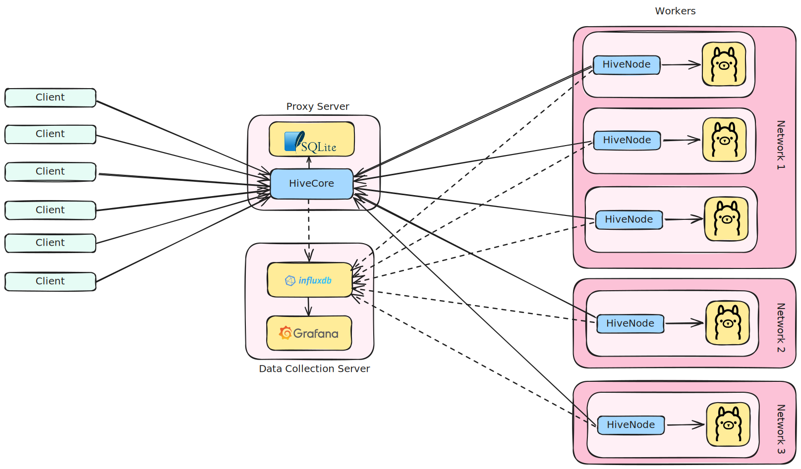
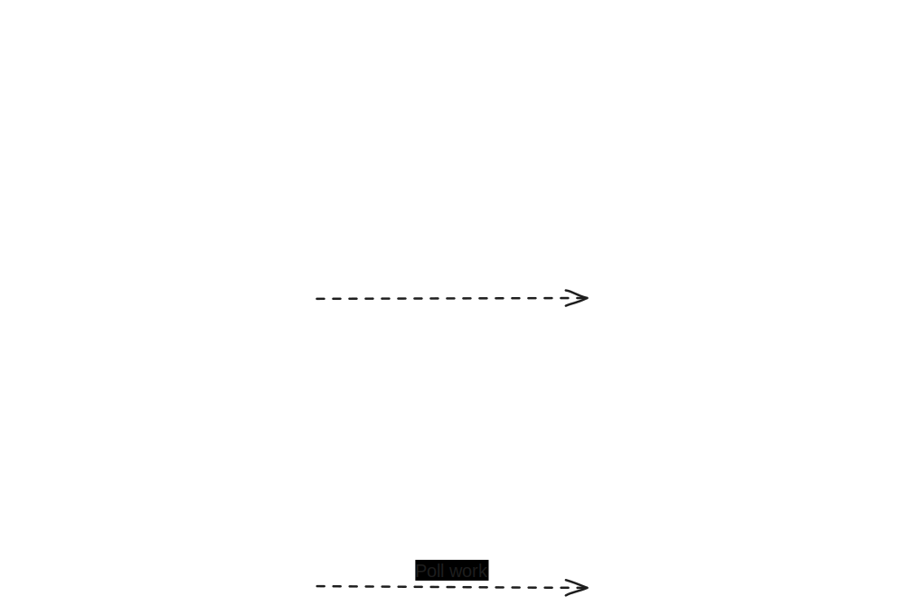

<div align="center">
  
    
</div>


# HiveCore

HiveCore is a proxy solution designed to unify scattered machines running [Ollama](https://github.com/ollama/ollama) and [HiveNode](http://github.com/VakeDomen/HiveNode) into a single, cohesive API. Whether you have multiple nodes each capable of Ollama inference or want a centralized gateway for distributing client requests, HiveCore helps you coordinate, monitor, and manage these worker nodes with ease.

One of HiveCore's standout features is its flexibility with network visibility. Worker machines don’t need to be publicly accessible or on the same network as the proxy server. As long as the workers can establish an outgoing connection to the proxy, they can seamlessly integrate into the system. This means you can deploy worker nodes in diverse locations—cloud servers, private data centers, the machine in your living room, or even behind firewalls—and HiveCore will bring them together into a unified API.

By simplifying connectivity requirements, HiveCore eliminates the need for complex network configurations or exposing individual worker nodes to the internet, focusing all visibility and management on the central proxy. This design makes HiveCore scalable and easy to integrate into existing infrastructure.

# Table of Contents

1.  [**Overview**](#1-overview)
2.  [**Key Features**](#2-key-features)
3.  [**Getting Started**](#3-getting-started)
4.  [**Architecture & Components**](#4-architecture--components)
5.  [**Usage & Configuration**](#5-usage--configuration)
6.  [**API Endpoints & Integration**](#6-api-endpoints--integration)
7.  [**Connecting workers**](#7-connecting-workers)
8.  [**Contributing**](#8-contributing)
9.  [**License**](#9-license)

* * *

# 1. Overview


**HiveCore** aims to streamline the process of distributing Ollama inference requests across multiple worker nodes. By acting as a proxy, HiveCore allows you to:

- **Centralize** client requests into one API endpoint, simplifying how your users interact with Ollama across various machines.
- **Authenticate** and **manage** nodes, optionally ensuring only verified systems can participate.
- **Distribute** requests to available nodes, balancing load for optimal performance.
- **Monitor** and **manage** keys, queues, and node statuses through HTTP endpoints.

* * *

# 2. Key Features
- **Ollama Proxy & Load Distribution**  
    Collect all your Ollama-ready machines under one unified API to handle inference requests.
- **Node Management & Monitoring**  
    Keep track of connected worker nodes, verifying their status, ping times, and capabilities.
- **Queue Management**  
    Incoming requests are queued and served as worker nodes become available, ensuring a smooth, organized flow of tasks.
- **Administrative API**  
    A suite of administrative endpoints for listing or inserting keys, inspecting worker nodes, and monitoring queue lengths.
- **SQLite Integration**  
    Authentication keys (and potentially more metadata) are stored and managed in a local SQLite database by default.

<div align="center">
  
    
</div>


* * *

# 3. Getting Started
1.  **Clone the Project**
    ```bash
    git clone https://github.com/VakeDomen/HiveCore.git
    cd HiveCore
    ```
3.  **Set Up the Database**
    - By default, HiveCore uses SQLite. Ensure your environment is capable of running SQLite. The SQLite database will be created automatically on the fist run of HiveCore.
4. **Build & Run**

    - Use Maven to clean and compile the project:
    Run the Maven lifecycle to clean and compile the project:
    ```bash
    mvn clean compile
    ```
    - Generate the Fat JAR with Dependencies: Use the maven-assembly-plugin to package everything into a single JAR:
    ```bash
    mvn compile assembly:single -f pom.xml
    ```
    - Run the generated jar or start the main class that launches **ClientServer**, **ManagementServer**, and **NodeServer**.
    ```bash
    java -jar target/HiveCore-1.0-SNAPSHOT-jar-with-dependencies.jar
    ```
   
* * *

# 4. Architecture & Components

- **NodeServer**  
    Listens for worker node connections running Ollama. Each node is required to authenticate. Once authenticated, tasks can be dispatched to it.
- **ClientServer**  
    Receives client requests for Ollama inference. These requests are placed in a queue and assigned to worker nodes as they become available.
- **ManagementServer**  
    Provides administrative endpoints for managing keys, viewing queue lengths, and checking node statuses.
- **NodeConnectionMonitor**  
    Periodically checks all connected nodes for timeouts or verification issues, removing inactive or unauthorized connections.
- **DatabaseManager**  
    Handles key storage in SQLite, offering CRUD operations for authentication keys.


* * *

# 5. Usage & Configuration

1.  **Configuration File**
    - When the HiveCore runs it first checks if there exists a `config.ini` file. If not, it creates one.
    - **`config.ini`**: Contains ports, timeout settings, and flags for authentication. Edit this file to change the default ports or enable/disable user authentication.
3.  **Authentication**
    - Some routes(requests targeting specific workers and management requests to proxy) require an `Authorization` header with the bearer token with an **Admin** role.
    - Additionally, the configuration allows locking all requests to proxy to require a **Client** key in the `Authorization` header.
4.  **Scaling**
    - To scale horizontally, run additional [worker nodes](https://github.com/VakeDomen/HiveNode) (each with Ollama) and point them to the same HiveCore proxy. 


Default `config.ini` example:
```
[Server]
USER_AUTHENTICATION = false
PROXY_PORT = 6666
NODE_CONNECTION_PORT = 7777
MANAGEMENT_CONNECTION_PORT = 6668

[Connection]
POLLING_NODE_CONNECTION_TIMEOUT = 10
WORKING_NODE_CONNECTION_TIMEOUT = 300
CONNECTION_EXCEPTION_THRESHOLD = 5
PROXY_TIMEOUT_MS = 60000
MESSAGE_CHUNK_BUFFER_SIZE = 16384

[Database]
DATABASE_URL = jdbc:sqlite:sqlite.db
```


* * *

# 6. API Endpoints & Integration

## Client server

HiveCore opens two main http endpoints. The main inference endpoint listens on the `PROXY_PORT`(default `6666`). Every request received on will be placed in a queue to be processed by one of the workers. Valid requests to this endpoint are all inference [requests supported](https://github.com/ollama/ollama/blob/main/docs/api.md#generate-a-completion) by Ollama, that specify a target model in the body.
### curl
```bash
curl http://example.com:6666/api/generate -d '{
  "model": "mistral-nemo",
  "prompt": "Why is the sky blue?"
}'
```

Since the requests are piped to the Ollama server, the proxy is compatible with all the main llm libraries that implement the Ollama API.

### Ollama-python

Example using [Ollama-python](https://github.com/ollama/ollama-python):

```python
from ollama_python.endpoints import GenerateAPI

api = GenerateAPI(base_url="http://example.com:6666", model="mistral")
result = api.generate(prompt="Hello World", options=dict(num_tokens=10), format="json")
```

### Langchain

Example using [Langchain](https://github.com/langchain-ai/langchain):

```python
from langchain_ollama.llms import OllamaLLM
from langchain_ollama import OllamaEmbeddings

embedding_model = OllamaEmbeddings(base_url="example.com:6666", model='bge-m3')
llm = OllamaLLM(base_url="example.com:6666", model='mistral-nemo')
```

### LlamaIndex

Example using [LlamaIndex](https://github.com/run-llama/llama_index):

```python
from llama_index.llms.ollama import Ollama

llm = Ollama(base_url="http://example.com:6666", model="mistral-nemo", request_timeout=60.0)

response = llm.complete("What is the capital of France?")
print(response)
```

### Targeted requests

By posting requests to the proxy the reuqest is put into a queue to be handled by one of the workers based on the model that is specified in the request. If however you want to target a specific worker, the proxy can forward any request to the worker Ollama server by specifying the `Node` header in the request. This however is only allowed if you have an `admin` bearer token specified in the `Authorization` header.

```bash
curl -X POST http://example.com:6666/api/generate \
    -H "Content-Type: application/json" \
    -H "Authorization: Bearer <admin token>" \
    -H "Node: <nodename>" \
    -d '{
      "model": "mistral-nemo",
      "prompt": "Why is the sky blue?"
    }'

```

## Management server

The second important endpoint the HiveCore exposes is the management server, running on `MANAGEMENT_CONNECTION_PORT` (default: `6668`). 

All requests to this server require the `Authorization` header to be set with the admin `Bearer <token>`. The routes here are specifically made for monitoring the state and health of the HiveCore proxy and generating keys for users of the system. 

### Avalible routes:


*   **GET** `/queue`
    *   **Purpose**: Retrieve queue lengths for both model-based and node-based queues.
    *   **Responses**:
        *   **200 OK** + JSON with queue sizes.
        *   **404 Not Found** if endpoint is invalid.
    *   **Body**:
    ```json
    {
        "Model: mistral-nemo": 63,
        "Model: bge-m3": 0,
        "Node: worker-2xA6000": 0,
        "Node: worker-2xA6000-2": 0
    }
    ```

* * *

*   **GET** `/worker/connections`
    *   **Purpose**: Retrieve the count of active connections for each worker node. The count represents the amount of concurrent requests each worker node is able to process.
    *   **Responses**:
        *   **200 OK** + JSON structure of node names to connection counts.
    *   **Body**:
    ```json
    {
        "Unauthenticated": 3,
        "worker-2xA6000-1": 8,
        "worker-2x-1080ti-1": 4,
        "worker-2x-1080ti-2": 4,
        "worker-H100-1": 12,
        "worker-H100-2": 12,
        "worker-H100-3": 12,
        "worker-3080-1": 4,
        "worker-3080-4": 4,
        "worker-3080-5": 4,
        "worker-3080-6": 4,
        "worker-cluster-16-1080ti": 2,
        "worker-cluster-17-1080ti": 2,
        "worker-cluster-18-1080ti": 2
    }
    ```

* * *

*   **GET** `/worker/status`
    *   **Purpose**: View each node’s verification status (e.g., `Verified`, `Waiting`, etc.).
    *   **Responses**:
        *   **200 OK** + JSON array of statuses per node.
    *   **Body**:
    ```json
    {
        "Unauthenticated": [
            "SettingUp",
            "SettingUp",
            "SettingUp"
        ],
        "worker-2xA6000-1": [
            "Working",
            "Working",
            "Working",
            "Working",
            "Working",
            "Working",
            "Working",
            "Working"
        ],
        "worker-2x1080ti-1": [
            "Polling",
            "Polling",
            "Working",
            "Working"
        ],
        "worker-2x1080ti-2": [
            "Polling",
            "Working",
            "Working",
            "Working"
        ],
        "worker-cluster-16-1080ti": [
            "Working",
            "Working",
            "Working",
            "Working"
        ]
    }
    ```

* * *

* **GET** `/worker/pings`
    *   **Purpose**: Check the last ping timestamps for each worker.
    *   **Responses**:
        *   **200 OK** + JSON structure with node names mapped to an array of timestamps.
    *   **Body**:
    ```json
    {
        "worker-1xA6000-1": [
            "2025-02-20T08:46:40.776027790",
            "2025-02-20T08:46:40.775862321",
            "2025-02-20T08:46:40.776019975",
            "2025-02-20T08:46:40.775880505"
        ],
        "worker-2xA6000-2": [
            "2025-02-20T08:46:40.775742978",
            "2025-02-20T08:46:40.775864545",
            "2025-02-20T08:46:40.760690376",
            "2025-02-20T08:46:40.760705805"
        ],
        "worker-DLT-2x-1080ti-1": [
            "2025-02-20T08:46:40.764027234",
            "2025-02-20T08:46:40.789959810",
            "2025-02-20T08:46:40.790090103",
            "2025-02-20T08:46:40.764031131"
        ]
    }
    ```

* * *

*   **GET** `/worker/tags`
    *   **Purpose**: Retrieve the tags (models) supported by each worker node.
    *   **Responses**:
        *   **200 OK** + JSON structure of node names to sets of tags.
    *   **Body**:
    ```json
    {
        "worker-2xA6000-2": [
            "mistral-nemo:latest",
            "bge-m3",
            "bge-m3:latest",
            "mistral-nemo"
        ],
        "worker-3xH100": [
            "mistral-nemo:latest",
            "bge-m3",
            "bge-m3:latest",
            "mistral-nemo",
            "deepseek-r1:671b"
        ],
        "worker-3080-6": [
            "mistral-nemo:latest",
            "bge-m3",
            "bge-m3:latest",
            "mistral-nemo"
        ]
    }
    ```

* * *

*   **GET** `/worker/versions`
    *   **Purpose**: Shows which Hive and Ollama versions each worker node is running.
    *   **Responses**:
        *   **200 OK** + JSON mapping of node names to node versions.
    *   **Body**:
    ```json
    {
        "worker-1xA6000-1": {
            "hive": "0.1.6",
            "ollama": "0.5.7"
        },
        "worker-2xA6000-2": {
            "hive": "0.1.6",
            "ollama": "0.5.7"
        },
        "worker-2xTitan-2": {
            "hive": "0.1.6",
            "ollama": "0.5.7"
        }
    }
    ```

* * *

*   **GET** `/key`

    *   **Purpose**: Retrieve a list of all stored authentication keys.
    *   **Responses**:
        *   **200 OK** + JSON array of keys.
        *   **404 Not Found** if no keys exist.
        *   **400 Bad Request** if an error occurs.
      ```json
      [
        {
          "id": 1,
          "name": "Admin",
          "value": "004c0a77-4af8-48cc-8690-4e7ccc33cf08",
          "role": "Admin"
        },
        {
          "id": 2,
          "name": "worker-2xA6000",
          "value": "c228f8df-8df3-4649-a964-t66bf816b50b",
          "role": "Worker"
        },
        {
          "id": 3,
          "name": "worker-2xA6000-2",
          "value": "e5a9343c-f643-467f-b1e5-2f0b2ad3c367",
          "role": "Worker"
        },
        {
          "id": 4,
          "name": "worker-cluster-16-1080ti",
          "value": "9bd93308-448a-4588-b86d-e92d76057957",
          "role": "Worker"
        },
        {
          "id": 5,
          "name": "worker-cluster-17-1080ti",
          "value": "4628b1b9-7d19-4713-8456-ca9a5ca9a6f4",
          "role": "Worker"
        } 
      ]
      ```
*   **POST** `/key`

    - **Purpose**: Insert a new key into the database.
    - **Body** (JSON):
        - possible roles: `Admin`, `Worker` and `Client`
        ```json
        { 
          "name": "MyNodeKey",   
          "role": "Admin" 
        }
        ```

    - **Responses**:
        - **200 OK** + newly generated key value if successful.
        ```text
        4628b1b9-7d19-4713-8456-ca9a5ca9a6f4
        ```
        - **400 Bad Request** if an error occurs (e.g., duplicate name).

* * *

# 7. Connecting workers
To connect worker nodes to the proxy see project [HiveNode](https://github.com/VakeDomen/HiveNode). The worker should have [Ollama](https://ollama.com/download) server installed and a HiveNode. The nodes connect to the third exposed port `NODE_CONNECTION_PORT` (default: `7777`). The node should have a valid `Worker` key generated by the admin of HiveCore. 

<div align="center">
  
    
</div>


# 8. Contributing

We welcome contributions! Please open an **issue** to discuss proposed changes before submitting a pull request. Make sure to:

*   Keep code style consistent.
*   Update documentation if you change or add features.

* * *

# 9. License

This project is distributed under the **MIT License**. See the LICENSE file for more details.

* * *

Thank you for considering **HiveCore** for your Ollama proxy needs! If you have questions, encounter any issues, or want to contribute, feel free to open an issue or submit a pull request. We look forward to collaborating with you!
